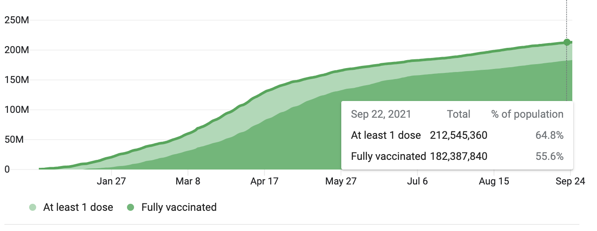
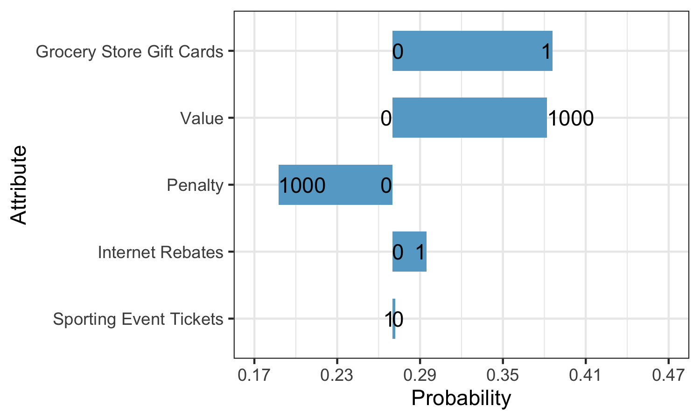

```{r setup, echo=FALSE, message=FALSE, warning=FALSE}
knitr::opts_chunk$set(
  warning = FALSE,
  message = FALSE,
  comment = "#>",
  fig.path = "figs/", # Folder where rendered plots are saved
  fig.width = 7.252, # Default plot width
  fig.height = 4, # Default plot height
  fig.retina = 3 # For better plot resolution
)

# Load libraries here
library(tidyverse)
library(here)
library(knitr)
library(logitr)
```


# Abstract

This study focuses on various policies that the US Federal government could enact to increase COVID-19 vaccination rates and stabilize the spread of COVID-19 with herd immunity. It compares a vaccine mandate enforced with a fine to various incentives such as tax rebates and sporting tickets. It also takes into account the accessibility of vaccination centers, measured by the proximity of vaccination centers from residencies, as well as combinations of these different policy attributes. The target population for this study are all Americans 18 years and older who have not received a dose of a COVID-19 vaccine. Below are lists of all possible values of each attribute included in the choice questions: 

- Type of incentives for compliance: cash, grocery store gift cards, internet rebates, sporting tickets
- Value of incentives for compliance ranging from $0-$1000 in increasing increments
- Value of fines for non-compliance ranging from $0-$1000 in increasing increments
- Distance from vaccination centers ranging from 0 miles from residences - 10 miles from residences in increasing increments

By collecting choice information on these potential attributes, we hope to gain insight on what incentives and/or penalties are the most effective in getting non-vaccinated U.S. residents above the age of 18 vaccinated.


# Introduction

Despite the rollout of COVID-19 vaccines, vaccine hesitancy prevented the United States from achieving herd immunity, the level of immunity that a population needs to control the spread of a virus. Below is a chart depicting the number of daily vaccinations over time as a percentage of the population, followed by a chart depicting the percentage of the American population that is vaccinated: 

<center>
  
</center>

<center>
  
</center>

On September 9th, 2021, U.S. President Joe Biden announced vaccine mandates for 100 million Americans, including federal employees and private-sector employees part of firms with over 100 people. This has been met with praise from some experts who claim that forcing Americans to get vaccinated is crucial, criticism from other experts who claim that resistance to vaccine mandates will cause labor shortages and is not effective enough to vaccinate enough of the population [for herd immunity], and hostile resistance, particularly from conservatives, who attack the Constitutional provision of the mandates. [View this article to read some of the reactions to Biden's order.](https://www.nytimes.com/2021/09/09/world/biden-covid-vaccine-requirements-reaction.html?campaign_id=9&emc=edit_nn_20210910&instance_id=40054&nl=the-morning&regi_id=77202080&segment_id=68558&te=1&user_id=9d1be558afe1d0264747cb1778f62d0a)

Vaccine mandates have been touted for months since the COVID-19 vaccine has become available, but before they were enacted many state and local governments started giving out positive incentives such as money or commodities. All levels of government, from the federal government to local, enacted initiatives to increase access to the vaccine by fighting misinformation and setting up mobile vaccination sites.

Our study analyzes the population and the effectiveness of various policies to increase vaccination rates. Each policy in our study consists of different attributes, which vary across each policy. The goal is to optimize the attributes to get as many people vaccinated as possible. The attributes to be considered are: 

### Accessibility

Accessibility refers to the distance which a vaccination clinic would be placed from your home. It varies with 0 (door-door vaccinations) - 10 miles from your residence. 

### Incentives

Incentives refers to the type of commodity that would be given out at tax season for being fully vaccinated against COVID-19 by the tax return deadline. It varies by the following cash tax rebates and cash equivalents (gift cards):

- Cash
- Grocery stores
- Internet providers
- Professional sporting events

### Incentive Value 

Incentive value refers to the value of commodities that would be given out at tax season for being fully vaccinated against COVID-19 by the tax return deadline. It varies by increasing increments from $0 to $1000. 

### Penalty

Penalty refers to the penalty due at tax season for failing to get a  being fully vaccinated against COVID-19 by the tax return deadline under a vaccine mandate. It varies by increasing increments from $0 to $1000. 


# Survey Design

In order to see what sort of policy would be most appealing to those who are currently unvaccinated, the survey is designed to only collect responses from those who would be able to choose to take the vaccine after seeing the policy options. This consists of adults 18 years or older who have not received any doses of a COVID-19 vaccine. Those under the age of 18 and who have already received a vaccine dose were excluded because they are unable to choose to take the vaccine. This survey is also restricted to United States residents only, as this policy would only be directed towards United States residents.

The survey also collects demographic information relating to age, gender identity, race, income, political affiliation, and geographic location to better inform which policies are most effective for which demographics. Educational material presented to the respondents include information on accessibility, incentives, incentive value, and mandate value, which make up the survey's attributes.

- Accessibility ranged from 0-10 miles for the distance a vaccination clinic would be placed from a respondent's home. The accessibility range starts at 0 miles because it is in the most convenient spot possible for a respondent to receive a vaccine, and the range ends at 10 miles because most respondents should have a vaccination location outside of 10 miles from their home.
- Incentive value ranged from $0-$1000 to see if there was a value below $1000 that would sway more people to receive the vaccine. This range stopped at $1000, as anything above that number would most likely be infeasible to implement into a policy.
- Incentives were provided as cash or cash equivalents (gift cards) redeemable at grocery stores, internet providers, and professional sporting events. This range of incentives were chosen as they are items that are necessary and/or popular among the general public.
- Penalties ranged from $0-$1000 to see if there was a value below $1000 that would sway more people to receive the vaccine. This range stopped at $1000, as anything above that number would most likely be infeasible to implement into a policy.


Each respondent receives 10 choice questions that have two options "I will take the vaccine under these conditions" (where the conditions are listed in the option) and "I will not take the vaccine under these conditions". There is one alternative per choice question (the vaccine conditions) and a no-choice option, where respondents are informed that it means they would not take the vaccine under the conditions listed in the first alternative. An example figure of a random conjoint question can be seen below.

<center>
  
</center>


# Data Analysis

### Sample Description 

The final pilot survey sample after cleaning consists of 107 respondents. The choice data sheet contains of 20 rows per respondent, denoting 2 alternatives per question (will you take the vaccine under this condition or not?) and 10 questions each. The following tables show a breakdown of some of our important survey respondents' demographics.

|       Gender      | Number of Respondents |
|:-----------------:|:---------------------:|
|        Male       |           52          |
|       Female      |           54          |
| Prefer not to say |           1           |

We had a pretty even split of gender with slightly more females.

| Year of Birth | Number of Respondents |
|:-------------:|:---------------------:|
|   1950-1959   |           7           |
|   1960-1969   |           8           |
|   1970-1979   |           5           |
|   1980-1989   |           27          |
|   1990-1999   |           36          |
|   2000-2002   |           11          |

Most of our respondents were born in the 1990s, and our survey respondents seemed to skew more towards a younger population of 20 and 30 year olds.

|    Ethnicity    | Number of Respondents |
|:---------------:|:---------------------:|
|      Asian      |           6           |
|      Black      |           9           |
|     Hispanic    |           6           |
| Native American |           3           |
|      White      |           80           |
|  Self-Identify  |           3          |

An overwhelming majority of our survey population was white. The 3 people who self-identified had written in their ethnicity as "TX" "American" and "North carolina".

| Income (in thousands of $) | Number of Respondents |
|:--------------------------:|:---------------------:|
|            < 10            |           3           |
|           10 - 20          |           7           |
|           20 - 30          |           13          |
|           30 - 40          |           9           |
|           40 - 50          |           14          |
|           50 - 75          |           19          |
|          75 - 100          |           15          |
|          100 - 150         |           14          |
|          150 - 200         |           6           |
|            > 200           |           3           |
|      Prefer not to say     |           5           |

Our respondents came from all income backgrounds.

|  Political Orientation | Number of Respondents |
|:----------------------:|:---------------------:|
| Strongly  Conservative |           8           |
|      Conservative      |           21          |
|  Leaning Conservative  |           7           |
|        Moderate        |           19          |
|     Leaning Liberal    |           5           |
|         Liberal        |           16          |
|    Strongly Liberal    |           8           |
|       Independent      |           19          |
|    Prefer not to say   |           4           |

There was a diverse distribution of political orientations for our respondents.

| Education Received | Number of Respondents |
|:------------------:|:---------------------:|
|    No High school  |           3           |
|     High School    |           18          |
|     Vocational     |           5           |
|    Some College    |           27          |
| Associate's Degree |           11          |
|  Bachelor's Degree |           34          |
|   Graduate Degree  |           8           |
|  Prefer not to say |           1           |

The majority of our survey population had some college education or more.

### Data Cleaning

When we first opened the responses from the three separate components, we noticed a lot of null values to numerous attributes, including session ids that seemed to be from unsuccessful attempts to view our survey, or from bots on the internet. To remove these values gracefully, we had to join these three components together by the session id, a unique identifier for each participant associated with the survey. To do so, we took out duplicate columns and removed null values for session. We also computed the time took to complete each survey component in unique columns. Then, we filtered out respondents that did not answer the choice questions and did not meet eligibility criteria. We only filtered out respondents based on if they didn't answer any choice questions because no one only partially answered th choice questions, so we could filter out only those who didn't answer any. There were 697 total respondents, but we trimmed it down to 107 because many did not meet the eligibility criteria and were not able to get to the choice questions. We also filtered out respondents who didn't pass the attention check, but no one was filtered out in this process as every respondent passed the attention check. 

### Modeling

Our utility model for each policy attribute is as follows: 

$ Uj = \beta_{value}x^{value} + \beta_{penalty}x^{penalty} +\beta_{accessibility_0}\delta^{accessibility_0} + \beta_{accessibility_1}\delta^{accessibility_1} +\beta_{accessibility_3}\delta^{accessibility_3} + \beta_{accessibility_10}\delta^{accessibility_1_0} + \beta_{cash}\delta^{cash} + \beta_{groceries}\delta^{groceries} + \beta_{internet}\delta^{internet} + \beta_{sports}\delta^{sports} $

The first two beta values represent continuous attributes, and for every change in value and penalty, the utility for policy j will increase by the beta value for that attribute * the level of the attribute. The last 8 beta values are for categorical attributes that can either be 0 or 1, with 0 denoting the attribute is not present and 1 denoting the presence of an attribute. If present, the utility for policy j will increase by the beta value for that attribute. The first four of those 8 beta values represent categorical variables for distance to a vaccination center, in miles from respondents' residences. The first accessibility coefficient represents door-door vaccination campaigns. The last four terms represents the type of incentive given out - cash, grocery store gift cards, internet rebates, or sporting event tickets. 

Using the model and the choice data, we then ran the logitr model using preference space to estimate the beta coefficients. Running a summary of the results returned to us the estimated coefficients and the standard error.

```{r echo=FALSE}
load(here("models","model.RData"))
# View summary of results
kable(data.frame(
  coefficients=coef(model), st_errors=se(model)))
```

We ran the mixed logit model on the data. We tried multiple combinations of attributes to vary with a normal distribution, and found that the optimal parameters were value, penalty, and every incentive type varying across a normal distribution. We also found that since the mixed logit model is not convex, using 50 multistarts optimizes the model. We tried multistarts ranging from 2 to 100, and found that the optimal model is found after 50. However, we found that even the optimal mixed logit model is not a good fit, as the expected value for each of the coefficients does not mirror the expected values of the coefficients when using a multinomial logit model. 

```{r echo=FALSE}
load(here("models","mxl_pref.RData"))
# View summary of results
kable(data.frame(coefficients = coef(mxl_pref),st_errors = se(mxl_pref)))
```

We ran the logitr model with resistant respondents, those who chose not to take the vaccine under all conditions (denoted by outsideGood). We called this subgroup the "resistant" group. We obtained this group by marking each respondent with a 0 or 1 denoting if they answered "no" to all choice questions, and running the logitr model with this group using separate attributes. 
```{r echo=FALSE}
load(here("models","model_resistant.RData"))
# View summary of results
kable(data.frame(
  coefficients=coef(model_resistant), st_errors=se(model_resistant)))
```

We ran the logitr model with conservative, liberal, and independent respondents, who self-identified with each respective political party. We obtained these groups by making dummy columns for each unique political orientation marking each respondent with a 0 or 1 denoting if they have a specific political orientation. We decided to narrow down the number of political groups to reflect our sample size by merging "strongly liberal" and "leaning liberal" into "liberal" and merging "strongly conservative" and "leaning conservative" into "conservative". We then ran the logitr model on these groups and independents using unique attributes. 

```{r echo=FALSE}
load(here("models","model_politics.RData"))
# View summary of results
kable(data.frame(coefficients = coef(model_politics),st_errors = se(model_politics)))
```

We ran the logitr model with low-income and high-income respondents, who self-identified with each respective income group. We obtained these groups by making dummy columns for each income bracket and marking each respondent with a 0 or 1 denoting if they fall in a particular income group. We decided to narrow down the number of political groups to reflect our sample size by merging respondents who earned less than $50,000 into the low-income group and merging respondents who earned $100,000 or more into the high-income group. We then ran the logitr model on these groups using unique attributes. 

```{r echo=FALSE}
load(here("models","model_income.RData"))
# View summary of results
kable(coef(model_income))
kable(se(model_income))
```

We ran the logitr model with Asian, Black, Hispanic, and Native American respondents, who self-identified with each respective race. We obtained these groups by making dummy columns for each race and marking each respondent with a 0 or 1 denoting if they fall in a particular ethnic group. Due to the fact that racial groups have unique biases, we could not merge racial groups and had to model Asians, Blacks, Hispanics, and Native Americans uniquely. We then ran the logitr model on these groups using unique attributes. 

```{r echo=FALSE}
load(here("models","model_ethnicity.RData"))
# View summary of results
kable(coef(model_ethnicity))
kable(se(model_ethnicity))
```

We ran the logitr model with poorly-educated and highly-educated respondents, who self-identified with each respective education level. We obtained these groups by making dummy columns for each education level and marking each respondent with a 0 or 1 denoting if they have earned a particular educational degree. We decided to narrow down the number of groups to reflect our sample size by merging respondents who did not hold a Bachelor's degree into the low-education group and merging respondents who earned a graduate degree into the high-income group. We then ran the logitr model on these groups using unique attributes. 

```{r echo=FALSE}
load(here("models","model_education.RData"))
# View summary of results
kable(coef(model_education))
kable(se(model_education))
```

# Results
```{r echo=FALSE}
scenario_continuous_params = data.frame(
    value=c(0,100,1000),
    penalty=c(0,100,1000)
)
scenario_categorical_params = data.frame(
    accessibility_1=c(0,1),
    accessibility_3=c(0,1),
    accessibility_10=c(0,1),
    incentive_grocery_store=c(0,1),
    incentive_internet=c(0,1),
    incentive_sport_tickets=c(0,1),
    outsideGood=c(0,1)
)
```
# Market scenarios 

We devised a total of 28 scenarios where we varied either incentive value or penalty with different accessibility levels (distances to vaccination centers) or incentive types, with door-to-door vaccinations and cash as an incentive being the reference values for accessibility and incentive type, respectively. Only value or penalty could be non-zero, exclusive to each scenario as we wanted to see the effects of each attribute individually. For each non-zero level of value or penalty, there were 7 possibilities, varying across each of the categorical attribute levels, including reference levels. Each scenario has two options, one with a combinations of choice attributes and outsideGood set to 0 denoting that a respondent would take a vaccine, and the other option with all chocie attributes set to 0 and outsideGood set to 1 denoting that a respondent would not take a vaccine in that scenario. 

## Continuous Parameters

For continuous attributes (value and penalty), we varied values between 0 (when the other attribute was in effect) and 1000. We decided to include 100 as a variable to take into account variation in coefficients. 

```{r echo=FALSE}
kable(scenario_continuous_params)
```

## Categorical Parameters

For categorical attributes (incentive type and accessibility), we varied values between 0 and 1 using dummy columns, with 1 denoting that a certain policy involves an incentive type or accessibility level. Since each scenario is exclusive to value or penalty, for every scenario involving a penalty, we only plotted scenarios that varied by accessibility and kept all incentive type values to 0. 

```{r echo=FALSE}
kable(scenario_categorical_params)
```

## Plotting Scenarios

We used the predict function from the stats package to calculate the logit probabilities of each alternative in the scenario, simulating the probability that an arbitrary respondent would take the vaccine in a particular scenario.

We made a table of the predicted probabilities that a respondent would take a vaccine. We also made two tornado plots - one plot of the change in probability of vaccination with types of incentives with reference to cash, and another with probabilities of the accessibility levels with reference to door-door vaccinations. We also made sensitivity plots of each of the incentive types, including cash, with plotting scenarios with different values of each type of unique incentive individually against a baseline scenario (no incentives, vaccination centers, or penalties). 

```{r echo=FALSE}
load(here("data","simulation.RData"))
kable(sim_multi %>% filter(altID == 1))
```


<center>
  
</center>

<center>
  
</center>

<center>
  
</center>

We found that increasing the value of incentives noticeably increased the value of the probability of vaccination, while increasing the penalties noticeably decreased the probability of vaccination. The probability of vaccination especially increased (10% higher) when the incentive was a grocery store gift card - implying that respondents were more inclined by grocery store incentives, and that respondents were hostile to penalties given the extremely low probabilities with high penalties. Moreover, we found that vaccination clinics within 1-3 miles of residences were most effective, as the probability of vaccination increased from door-door vaccinations, but decreased slightly with vaccination centers within 10 miles of residences. 


# Final Recommendations and Conclusions

In general, findings from our analysis were ultimately disappointing- our survey data found that although some people may respond to incentives and receive the vaccine, the vast majority of the unvaccinated population seems to be set on not receiving the vaccine. When asked for feedback on the survey, one  respondent commented: "Under no circumstances including death will I ever take the covid 19 vaccine". We classified 49 out of our 107 respondents as resistant, meaning that they answered that they would not take the COVID-19 vaccine under any of the incentives given to them in all 10 choice questions. To put into context how resistant this group is, some of our incentives and penalties valued up to $1000 and they still chose to not take the vaccine.

Despite all of this, we were able to gather some interesting findings. Out of all the incentives offered, our population had the largest preference for our grocery store incentive, even over cash. This finding was surprising, considering people would have had more ways to use the incentive if given cash instead of a grocery store incentive. When looking at the value of the incentive, the dollar amount seemed to be insignificant. This is because as the incentive value increased by hundreds of dollars, up to $1000, the value found diminishing returns. If an incentive were to be implemented, a standard value of $100 would allow policymakers to receive the most bang for their buck.

Our survey results also showed that having accessibility to the vaccine could act as a nice supplement to a grocery store incentive for a vaccine policy. A preferable accessibility distance to the vaccine for our survey respondents was within 3 miles of their home. Bringing in the accessibility within 1 mile only swayed a few more respondents, while not many were swayed by accessibility within 10 miles. Specific values can be seen in our accessibility tornado plot.

Based on the tornado plot of policy attributes, we recommend against penalties for non-compliance. Respondents became more and more averse to receiving a vaccine as the penalty value increased. Not only did penalties fail to convince respondents to take the vaccine, but it made them even more resistant. This resistance to compliance showed that a positive incentive would be much better received than a penalty.

# Limitations

There were many limitations to this survey, the largest being the sample size. With only 107 respondents, a much larger sample size would have allowed a much better confidence interval and standard deviation in all of our data. We would also be able to better see the preferences between the different demographics such as age, ethnicity, education, income, location, and political orientation. This could be useful in determining where to implement certain policies. For example, the sporting ticket incentive was least preferred when compared to cash, a grocery store incentive, and an internet incentive. However, in a state like Texas, where football is a religion and there are countless beloved professional and college sports teams, a subgroup analysis of Texans could find a huge preference for a sporting ticket incentive. Different groups of people will have different preferences and our analysis was only able to scratch the surface in discovering these. Gathering more survey data would be essential in having a more robust and confident analysis, which can inform policymakers to create the most effective policy.

Furthermore, with more time, the interactions between different variables could also be studied. As mentioned, the grocery store incentive was found to be more effective as an incentive for people to take the vaccine than cash. The relationship between the cash incentive and the grocery store incentive could be studied, along with other attributes, to be sure of any interaction effects. If this interaction were studied, it could be found that cash is just as effective as a grocery store incentive.

# Appendix

Survey Link: https://covid-19-vaccine-policy-final.formr.org

## Introduction

Welcome to our survey!

Welcome and thank you for your interest in our survey! The purpose of this survey is to develop a quantitative model of consumer choice to inform the design decisions of a COVID vaccine policy. This survey is being conducted for a research initiative at The George Washington University. You must be a resident of the United States above the age of 18 and who has not received a dose of a COVID-19 vaccine to partake in this survey. You must also not have a health condition or disability that prevents you from being eligible to take the COVID-19 vaccine. 

This survey involves questions that ask whether a certain condition would result in you receiving the COVID-19 vaccine. These conditions can be seen as positive, negative, or neutral. These conditions will not actually occur and you will not need to take a COVID-19 vaccine based on your answers in this survey. At the end of the survey we will also be collecting demographic information.

If you have any questions about this survey, then please contact marketingvaccinepolicy@gmail.com.

## Consent and Eligibility

Your participation in this survey is voluntary. You may choose not to participate. If you decide to participate in this survey, you may withdraw at any time with no penalty. All responses will be used solely for academic purposes. Your responses will be confidential and we will not collect or share any identifying data such as your name or address.

The whole survey will take approximately 10 to 15 minutes to complete. Your participation is voluntary and you may stop the survey at any time. If you are eligible to and would like to participate, please answer the following questions:

I am age 18 or older.

- Yes
- No

I have not received any doses of a COVID-19 vaccine.

- Yes
- No

I am a U.S. resident.

- Yes
- No

I do not have a disability or health condition that prevents me from being able to take the COVID-19 vaccine.

- Yes
- No

I have read and understand the above information.

- Yes
- No

## Education

Great work! Now that you've shared a bit about yourself, we'd like you to consider policies designed to encourage COVID-19 vaccinations. Let's learn about policy attributes.

## Policy Attributes

Below is a description of the various policy attributes that will vary across every policy - each policy will be a combination of a universal vaccine mandate, enforced by a fine at tax season for not complying, different types of monetary incentives given out at tax season for being fully vaccinated against COVID-19, and the administration of vaccination clinics. Each attribute contains an associated image helping to explain the attribute.

### Accessibility

Accessibility refers to the distance in which a vaccination clinic would be placed from homes. It varies with increasing increments from 0-10 miles from a constituent's residence. A distance of 0 miles indicates door-door in-residence vaccination campaigns, a distance greater than 0 miles indicates that the policy involves a mobile or indoor public vaccination clinic.

<center>
  
</center>

### Incentives

Incentives refers to the type of commodity that would be given out at tax season as an incentive for being fully vaccinated against COVID-19 by the tax return deadline. It varies by cash (tax rebates) and cash equivalents (gift cards) redeemable at: 

- Grocery stores 
- Internet providers 
- Professional sporting events

<center>
  
</center>

### Incentive Value

Incentive value refers to the monetary value of commodities that would be given out at tax season for being fully vaccinated against COVID-19 by the tax return deadline. It varies by increasing increments from $0 to $1000.

<center>
  
</center>

### Penalty Value

This value refers to the penalty due at tax season for failing to get a being fully vaccinated against COVID-19 by the tax return deadline under a vaccine mandate. It varies by increasing increments from $0 to $1000.

<center>
   
</center>

## Practice Question

We would like to begin with one practice question below. Your response to this question will not be recorded.

If these were the only options available, would you choose to take the vaccine under the policy below?

**Mandate**: Vaccine mandated, $100 fine for non-compliance
**Accessibility**: Vaccination clinic will be located within 3 miles from your house
**Incentive**: $50 in cash"

- Yes
- No

## Conjoint Questions

Great work!

We will now begin with the questions. On the next few pages we will show you different combinations of policy options regarding COVID-19 vaccinations. There will be a total of 10 choice questions for you to answer. (Image shown below is an example of a choice question)

<center>
  
</center>

## Respondent Information
Nice job!

We're almost done! We'd just like to ask just a few more questions about you which we will use solely to analyze our survey data.

(1) In what year were you born?

- All years from 1920-2003 are listed

(2) What is your current gender identity?

- Male
- Female
- Trans male/trans man
- Trans female/trans woman
- Genderqueer/gender non-conforming
- Prefer not to say

Different identity (please state):

(3) I identify my race as (select all that apply):

- Native American or Alaskan Native (e.g., Navajo Nation, Blackfeet Tribe, Mayan, Aztec, Native Village of Barrow Inupiat Traditional Government, Nome Eskimo Community, etc.)
- Asian (e.g., Chinese, Filipino, Indian, Vietnamese, Korean, Japanese, Malaysian, etc.)	African (e.g., African American, Jamaican, Haitian, Nigerian, Ethiopian, Somalian, etc.)
- Hispanic or Latino (e.g., Mexican or Mexican American, Puerto Rican, Cuban, Salvadoran, Dominican, Colombian, etc.)
- Middle Eastern or North African (e.g., Lebanese, Iranian, Egyptian, Syrian, Moroccan, Algerian, etc.)
- Native Hawaiian or Pacific Islander (e.g., Native Hawaiian, Samoan, Chamorro, Tongan, Fijian, Marshallese, etc.)
- Caucasian (e.g., German, Irish, English, Italian, Polish, French, etc.)	Prefer not to say

Different identity (please state):

(4) What is your annual household income (from all sources) before taxes and other deductions from pay?

- Less than $10,000
- $10,000 - $14,999
- $15,000 - $24,999
- $25,000 - $34,999
- $35,000 - $49,999
- $50,000 - $74,999
- $75,000 - $99,999
- $100,000 - $149,999
- $150,000 - $199,999
- $200,000 or more
- Prefer not to say

(5) What is your political orientation?

- Strongly conservative
- Conservative
- Leaning conservative
- Moderate
- Leaning liberal
- Liberal
- Strongly liberal
- Independent
- Prefer not to say

(6) What is your primary mode of transportation?

- Personal vehicle
- Public transportation (Bus, Rail, Ferry, etc.)
- Ride-hailing service (e.g. Taxi, Lyft, Uber, Via, UberPool)
- Para-transit services
- Prefer to self-describe

(7) What state do you live in? 

- Alabama
- Alaska
- Arizona
- Arkansas
- California
- Colorado
- Connecticut
- Delaware
- District of Columbia
- Florida
- Georgia
- Hawaii
- Idaho
- Illinois
- Indiana
- Iowa
- Kansas
- Kentucky
- Louisiana
- Maine
- Maryland
- Massachusetts
- Michigan
- Minnesota
- Mississippi
- Missouri
- Montana
- Nebraska
- Nevada
- New Hampshire
- New Jersey
- New Mexico
- New York
- North Carolina
- North Dakota
- Ohio
- Oklahoma
- Oregon
- Pennsylvania
- Rhode Island
- South Carolina
- South Dakota
- Tennessee
- Texas
- Utah
- Vermont
- Virginia
- Washington
- West Virginia
- Wisconsin
- Wyoming


(8) What is the highest degree or level of school you have completed? If currently enrolled, please use the highest degree received.

- Less than a high school diploma
- High school degree or equivalent (e.g. GED)
- Some college or university, no college degree
- Trade/technical/vocational training, no degree awarded
- Associate's degree (e.g. AA, AS)
- Bachelor’s degree (e.g. BA, BS)
- Graduate or Professional Degree (e.g. PhD, MD, JD, MS)
- Prefer not to say

(9) Do you have a religious exemption that prevents you from taking the COVID-19 vaccine?

- Yes
- No

---

We have reached the end. Please let us know if you have any other thoughts or feedback on this survey.
 
Your feedback will help us make future improvements :) Thank you so much for taking this survey.

(Open text response)

