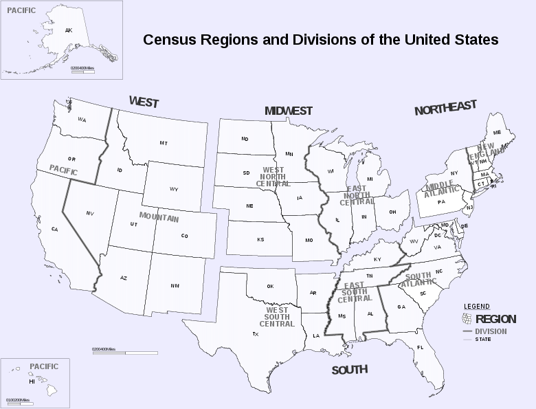

```{r, include = FALSE}
knitr::opts_chunk$set(
  collapse   = TRUE,
  warning    = FALSE,
  message    = FALSE,
  comment    = "#>",
  fig.path   = "man/figures/",
  fig.retina = 3
)
```

## Thank you for your feedback! The next section will ask some basic questions about yourself.

### Please answer to the best of your knowledge.

---

## Demographic information

We're almost done! We'd just like to ask just a few more questions about you which we will only use for analyzing our survey data.

(1) In what year were you born?

(Drop down menu including `Prefer not to say` and years `1920` - `2003`)

(2) What is your current gender identity?
Different identity (please state):

- Male
- Female
- Trans male/trans man
- Trans female/trans woman
- Genderqueer/gender non-conforming
- Prefer to self-identify
- Prefer not to say


(3) I identify my race as (select all that apply):
Different identity (please state):

- Native American or Alaskan Native (e.g., Navajo Nation, Blackfeet Tribe, Mayan, Aztec, Native Village of Barrow Inupiat Traditional Government, Nome Eskimo Community, etc.)
- Asian (e.g., Chinese, Filipino, Indian, Vietnamese, Korean, Japanese, Malaysian, etc.)
- African (e.g., African American, Jamaican, Haitian, Nigerian, Ethiopian, Somalian, etc.)
- Hispanic or Latino (e.g., Mexican or Mexican American, Puerto Rican, Cuban, Salvadoran, Dominican, Colombian, etc.)
- Middle Eastern or North African (e.g., Lebanese, Iranian, Egyptian, Syrian, Moroccan, Algerian, etc.)
- Native Hawaiian or Pacific Islander (e.g., Native Hawaiian, Samoan, Chamorro, Tongan, Fijian, Marshallese, etc.)
- White (e.g., German, Irish, English, Italian, Polish, French, etc.)
- Prefer to self-identify
- Prefer not to say


(4) What is the highest degree or level of school you have completed? If currently enrolled, please use the highest degree received.

- Less than a high school diploma
- High school degree or equivalent (e.g. GED)
- Some college or university, no college degree
- Trade/technical/vocational training, no degree awarded
- Associate's degree (e.g. AA, AS)
- Bachelor’s degree (e.g. BA, BS)
- Graduate or Professional Degree (e.g. PhD, MD, JD, MS)
- Prefer not to say

(5) How old are you?

- 18 - 19 years old
- 20 - 29 years old
- 30 - 39 years old
- 40 - 49 years old
- 50 - 59 years old
- 60 - 69 years old
- 70 - 79 years old
- 80+ years old

(6) What is your political orientation?

- Strongly conservative
- Conservative
- Leaning conservative
- Moderate
- Leaning liberal
- Liberal
- Strongly liberal
- None
- Prefer not to say


<center>
  
</center>

(7) Based on the above map, what region of the country do you live in? 

- New England 
- Middle Atlantic
- South Atlantic
- East South Central 
- East North Central 
- West South Central 
- West North Central 
- Mountain
- Pacific


(8) What is your annual net income?

- Under $60,000
- $60,000 - $80,000
- $80,000 - $100,000
- $100,000 - $120,000
- $120,000 - $120,000
- $140,000 - $120,000
- $160,000 - $120,000
- $180,000 - $120,000
- Above $200,000

---

Please let us know if you have any other thoughts or feedback on this survey.

Your feedback will help us make future improvements :)

(Open text response)

---

```{r, include=FALSE}
completionCode <- round(runif(1, 10^5, 10^6))
```

### Your completion code is: `r completionCode`

Finish
