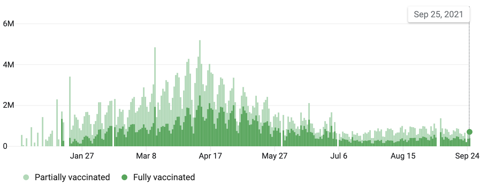
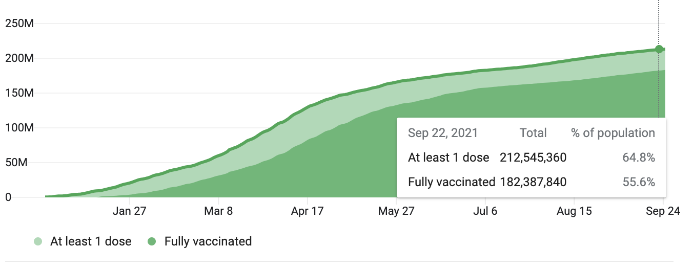

```{r setup, echo=FALSE, message=FALSE, warning=FALSE}
knitr::opts_chunk$set(
  warning = FALSE,
  message = FALSE,
  comment = "#>",
  fig.path = "figs/", # Folder where rendered plots are saved
  fig.width = 7.252, # Default plot width
  fig.height = 4, # Default plot height
  fig.retina = 3 # For better plot resolution
)

# Load libraries here
library(tidyverse)
library(here)
```


# Abstract

This study focuses on the various policies that the US Federal government can enact to increase COVID-19 vaccination rates and stabilize the spread of COVID-19 with herd immunity. It compares a vaccine mandate enforced with a fine, the policy in question, to various incentives such as tax rebates and sporting tickets. It also takes into account the accessibility of vaccination centers, measured by the proximity of vaccination centers from residencies, as well as combinations of these different policy attributes. The target population for this study are all Americans 18 years and older who have not received a dose of a COVID-19 vaccine. Below are lists of all possible values of each attribute included in the choice questions: 

```{r echo=FALSE}
incentive = c("Grocery Store Gift Card", "Internet Rebate", "Sporting Tickets", "Cash")
value = c(0, 50, 100, 200, 300, 500, 1000)
penalty = c(0, 50, 100, 200, 300, 500, 1000)
accessibility = c(0, 1, 3, 10) # Distance (miles) from a vaccination center

```
Accessibility (miles from residency): 
```{r echo=FALSE}
accessibility
```
Incentive (cateogrical): 
```{r echo=FALSE}
incentive
```
Mandate Fine (USD, no mandate for values of $0): 
```{r echo=FALSE}
penalty
```
Incentive Value (USD, no incentive for values of $0): 
```{r echo=FALSE}
value
```

# Introduction

Despite the rollout of COVID-19 vaccines, vaccine hesitancy prevented the United States from achieving herd immunity, the level of immunity that a population has to control the spread of a virus. Below is a chart depicting the number of daily vaccinations over time as a percentage of the population, followed by a chart depicting the percentage of the American population that is vaccinated: 

<center>
  
</center>

<center>
  
</center>

In turn, the Delta variant, a highly-contagious strain of SARS-COV-2, the virus that causes COVID-19, ravaged through unvaccinated populations and caused a surge in cases. 


### Accessibility

Accessibility refers to the distance which a vaccination clinic would be placed from your home. It varies with 0 (door-door vaccinations) - 10 miles from your residence. 


### Incentives

Incentives refers to the type of commodity that would be given out at tax season for being fully vaccinated against COVID-19 by the tax return deadline. It varies by cash tax rebates and cash equivalents (gift cards) redeemable at:

- Grocery stores
- Internet providers
- Professional sporting events 

### Incentive Value 

Incentive value refers to the value of commodities that would be given out at tax season for being fully vaccinated against COVID-19 by the tax return deadline. It varies by increasing increments from $0 to $1000. 

### Penalty

Incentive value refers to the penalty due at tax season for failing to get a  being fully vaccinated against COVID-19 by the tax return deadline under a vaccine mandate. It varies by increasing increments from $0 to $1000. 

# Survey Design

In order to see what sort of policy would be most appealing to those who are currently unvaccinated, the survey is designed to only collect responses from those would be able to choose to take the vaccine after seeing the policy options. This consists of adults 18 years or older who have not received any doses of a COVID-19 vaccine. This survey is also restricted to United States residents only, as this policy would only be directed towards United States residents.

The survey also collects demographic information relating to age, gender identity, race, income, political affiliation, and geographic location to better inform which policies are most effective for which demographics. Educational material presented to the respondents include information on accessibility, incentives, incentive value, and mandate value, which make up the survey's attributes.


- Accessibility ranged from 0-10 miles for the distance a vaccination clinic would be placed from a respondent's home. The accessibility range starts at 0 miles because it is in the most convenient spot possible for a respondent to receive a vaccine, and the range ends at 10 miles because most respondents should have a vaccination location outside of 10 miles from their home.
- Incentive value ranged from $0-$1000 to see if there was a value below $1000 that would sway more people to receive the vaccine. This range stopped at $1000, as anything above that number would most likely be infeasible to implement into a policy.
- Incentives were provided as cash or cash equivalents (gift cards) redeemable at grocery stores, internet providers, and professional sporting events. This range of incentives were chosen as they are items that are necessary and/or popular among the general public.
- Penalties ranged from $0-$1000 to see if there was a value below $1000 that would sway more people to receive the vaccine. This range stopped at $1000, as anything above that number would most likely be infeasible to implement into a policy.


Each respondent receives 10 choice questions that have two options "I will take the vaccine under these conditions" (where the conditions are listed in the option) and "I will not take the vaccine under these conditions". There is one alternative per choice question (the vaccine conditions) and a no-choice option, where respondents are informed that it means they would not take the vaccine under the conditions listed in the first alternative. An example figure of a random conjoint question can be seen below.


# Pilot Data Analysis

### Data Cleaning 

When we first opened the responses from the three separate components, we noticed a lot of null values to numerous attributes, including session ids that seemed to be from unsuccessful attempts to view our survey, or from bots on the internet. To remove these values gracefully, we had to join these three components together by the session id, a unique identifier for each participant associated with the survey. To do so, we took out duplicate columns and removed null values for session. We also computed the time took to complete each survey component in unique columns. Then, we filtered out respondents that did not answer the choice questions and did not meet eligibility criteria. There were about 20-30 total respondents, but the actual number is not known because some responses on each part were due to unsuccessful attempts to take the survey (i.e. partial responses, bots, poor network connection, etc.).

## Sample Description

The final pilot survey sample after cleaning consists of 7 respondents who answered all 10 choice questions and met the eligibility criteria. The choice data sheet contains of 20 rows per respondent, denoting 2 alternatives per question (will you take the vaccine under this condition or not?) and 10 questions each. 


```{r echo=FALSE}
data <- read_csv(here("data", "choiceData.csv"))
data
```
### Demographic Analysis

To analyze our sample by each demographic factor, we first filtered out any respondent who did not answer the particular demographic question. We then grouped respondents by demographic and divided the number of responses to each demographic by 20 (since each respondent appears 20 times on the survey) to get the number of respondents in each demographic attribute level. 

We were first interested in the politics of our respondents. We found that most of our sample was liberal, with a couple independents and leaning conservatives. This deviates from our ideal sample - we will need responses across a wide political spectrum and we will need more samples in each category - a liberal sample may skew responses towards agreeing to take the vaccine under smaller conditions. 
```{r echo=FALSE}
political_label <- c("Strongly conservative", "Conservative", "Leaning conservative",	"Moderate", "Leaning liberal",	"Liberal",	"Strongly liberal",	"Independent",	"Prefer not to say")
politics <- c(1:9)
politics_df <- data.frame(politics,political_label)
politics <- data %>% filter(!is.na(politics)) %>% select(politics) %>% group_by(politics) %>% summarise(num_respondents = n()/20) %>% inner_join(politics_df,by=c("politics"))
politics
```

We were also interested in the income brackets of our respondents. We found that most of our sample makes under $50,000 per year, which can give us insights about vaccine policies for poorer families, but we will need more responses from a higher income bracket to validate the effect of income on vaccine hesitancy. 
```{r echo=FALSE}
incomes <- data %>% select(income) %>% filter(!is.na(income)) %>%  group_by(income) %>% summarise(num_respondents = n()/20)
incomes
```

We then looked at the regions of residencies of our respondents. We found that our sample is overwhelmingly from the East Coast, with a few responses from the West Coast and the Rocky Mountains. We will need more responses from the Midwest and New England. We also realize from the low variation in region that splitting up our sample by state will give us a more granular analysis on the effect of location on vaccine sentiment. 
```{r echo=FALSE}
region_label <- c("New England",	"Middle Atlantic",	"South Atlantic", "East South Central",	"East North Central",	"West South Central",	"West North Central",	"Mountain",	"Pacific")
region <- c(1:9)
region_df <- data.frame(region,region_label)
regions <- data %>% select(region) %>% filter(!is.na(region)) %>%  group_by(region) %>% summarise(num_respondents = n()/20) %>% inner_join(region_df,by=c("region"))
regions
```

We also looked at the genders of our respondents. The sample is more balanced with respect to gender with other demographic attributes like we want, but the sample can use more male responses, as well as responses from those in the trans/non-binary community. 
```{r echo=FALSE}
genders <- data %>% select(gender) %>% filter(!is.na(gender)) %>%  group_by(gender) %>% summarise(num_respondents = n()/20)
genders
```
We also looked at the ages of our sample. We noticed that all our respondents are young adults, and we need more samples from the elderly and middle-aged adults to get a better prediction for age as their is more likely to be variation between generations as opposed to ages within a generation.

```{r echo=FALSE}
ages <- data %>% select(yearOfBirth) %>% filter(!is.na(yearOfBirth))  %>% mutate(age = 2021-as.numeric(yearOfBirth)) %>%  group_by(age) %>% summarise(num_respondents = n()/20)
ages[is.na(c("age"))] <- "Prefer not to say"
ages
```
### Modeling

Our utility model for each policy attribute is as follows: 
$$
Uj = \beta_{1}x^{value} + \beta_{2}x^{penalty} + \beta_{3}x^{accessibility} + \beta_{4}x^{cash} \beta_{5}x^{groceries} \beta_{6}x^{internet} \beta_{7}x^{sport}
$$
The first three beta values represent continuous attributes, and for every change in value, accessibility, and penalty, the utility for policy j will increase by the beta value for that attribute * the level of the attribute. The last four beta values are for categorical attributes that can either be 0 or 1, with 0 denoting the attribute is not present and 1 denoting the presence of an attribute. If present, the utility for policy j will increase by the beta value for that attribute. 

Using the model and the choice data, we then ran the logitr model using preference space to estimate the beta coefficients. Running a summary of the results returned to us the estimated coefficients and the standard error. It also returned to us the log likelihood that the coefficients are correct and can be used to accurately estimate utility. 

```{r echo=FALSE}
library(janitor)
library(logitr)
# Clean up names of created variables
data <- clean_names(data)
# Estimate the model
model <- logitr(
    data   = data,
    outcome = "choice",
    obsID  = "obs_id",
    pars   = c(
        "value", 
        "penalty",
        "accessibility",
        "incentive_cash",
        "incentive_grocery_store",
        "incentive_internet",
        "incentive_sport_tickets"
    )
)
# View summary of results
summary(model)
```

We then validated the accuracy of the model by checking whether the model is at a maximum, because we need to maximize log likelihood. We checked the results against the first-order and second-order derivatives of the model.

```{r echo=FALSE}
# Check the 1st order condition: Is the gradient at the solution zero?
model$gradient
# 2nd order condition: Is the hessian negative definite?
# (If all the eigenvalues are negative, the hessian is negative definite)
eigen(model$hessian)$values
``` 
The first derivates for each attribute were close but not equal to 0. The second order derivatives in the hessian are all negative, denoting that the model has a maximum and is curved down. Since most first order derivatives are positive and all second order derivatives are negative, we can infer that the optimal values for betas are higher than estimated by the model, and for attributes with a negative first derivative, the actual values for betas are lower than estimated. But we concluded that with more data it would be easier to find measurable optimal values for beta. 

We then extracted the coefficients and standard errors to reference when plotting each attribute. 
```{r echo=FALSE}
coefs <- coef(model)
coefs
ses <- se(model)
ses
```

After getting the estimates and errors for beta, we proceeded to plot the utility for each attribute with each beta estimate. For plotting each attribute:

- We created a new data frame containing estimates plus upper and lower bound estimates calculated by the estimated coefficient, the standard error, and the attribute level. The upper and lower bounds are the 95% confidence interval for the estimate, or beta +- 2* std_err. 
- We plotted the attribute and the upper and lower bounds. For categorical attributes, we used box and whiskers plots to show the confidence interval. For continuous attributes, we shaded in the confidence interval. 

#### Plot for value of incentive

We plotted the value of the incentive to utility, and there was high variation, particularly for higher values of beta. 

```{r echo=FALSE}
df_value <- data.frame(value =unique(data$value)) %>% 
    mutate(
        diff    = value - min(value),
        utility = diff*coefs['value'],
        upper =  diff*(coefs['value']+2*ses['value']),
        lower =  diff*(coefs['value']-2*ses['value'])
    )
    
# Get upper and lower bounds (plots should have the same y-axis)
ymin <- floor(min(df_value$lower))
ymax <- ceiling(max(df_value$upper))
# Plot the utility for each attribute
plot_value <- df_value %>% 
    ggplot(aes(x = value, y = utility,ymin=lower,ymax=upper)) +
    geom_line() +
    geom_ribbon(alpha=0.2) +
    scale_y_continuous(limits = c(ymin, ymax)) +
    labs(x = 'Value of incentive ($)', y = 'Utility') +
    theme_bw()

plot_value
```
The plot for the value of incentive shows a generally positive utility with a very large confidence interval. This significant variance needs to be offset by more samples. We hope to receive more respondents in our actual survey in order to minimize the variance.


#### Plot for accessibility to vaccination center
```{r echo=FALSE}
df_accessibility <- data.frame(accessibility = unique(data$accessibility)) %>% 
    mutate(
        diff    = accessibility - min(accessibility),
        utility = diff*coefs['accessibility'],
        upper =  diff*(coefs['accessibility']+2*ses['accessibility']),
        lower =  diff*(coefs['accessibility']-2*ses['accessibility'])
)
# Get upper and lower bounds (plots should have the same y-axis)
ymin <- floor(min(df_accessibility$lower))
ymax <- ceiling(max(df_accessibility$upper))
plot_accessibility <- df_accessibility %>% 
    ggplot(aes(x = accessibility, y = utility,ymin=lower,ymax=upper)) +
    geom_line() +
    geom_ribbon(alpha=0.2) +
    scale_y_continuous(limits = c(ymin, ymax)) +
    labs(x = 'Distance of nearest vaccination center (miles)', y = 'Utility') +
    theme_bw()
plot_accessibility
```

The plot for accessibility to a vaccination center shows a generally positive utility with a large confidence interval. This significant variance needs to be offset by more samples. We hope to receive more respondents in our actual survey in order to minimize the variance.

#### Plot for non-compliance penalty
```{r echo=FALSE}
df_penalty <- data.frame(penalty = unique(data$penalty)) %>% 
    mutate(
        diff    = penalty - min(penalty),
        utility = diff*coefs['penalty'],
        upper =  diff*(coefs['penalty']+2*ses['penalty']),
        lower =  diff*(coefs['penalty']-2*ses['penalty'])
    )
# Get upper and lower bounds (plots should have the same y-axis)
ymin <- floor(min(df_penalty$lower))
ymax <- ceiling(max(df_penalty$upper))
plot_penalty<- df_penalty %>% 
    ggplot(aes(x = penalty, y = utility, ymin=lower, ymax=upper)) +
    geom_line() +
    geom_ribbon(alpha=0.2) +
    scale_y_continuous(limits = c(ymin, ymax)) +
    labs(x = 'Penalty for non-compliance ($)', y = 'Utility') +
    theme_bw()
plot_penalty
```

The plot for a non-compliance penalty shows a slightly negative utility with a moderately big confidence interval. This variance needs to be offset by more samples. We hope to receive more respondents in our actual survey in order to minimize the variance.

#### Plot for cash incentives
```{r echo=FALSE}
df_cash <- data.frame(incentive_cash = unique(data$incentive_cash)) %>% 
    mutate(
        utility = incentive_cash*coefs['incentive_cash'],
        upper =  incentive_cash*(coefs['incentive_cash']+2*ses['incentive_cash']),
        lower =  incentive_cash*(coefs['incentive_cash']-2*ses['incentive_cash'])
    )
# Get upper and lower bounds (plots should have the same y-axis)
ymin <- floor(min(df_cash$lower))
ymax <- ceiling(max(df_cash$upper))
plot_cash<- df_cash %>% 
    ggplot(aes(x = incentive_cash, y = utility, ymin=lower, ymax=upper)) +
    geom_point() +
    geom_errorbar(width=0.3)  +
    scale_y_continuous(limits = c(ymin, ymax)) +
    labs(x = 'Cash incentive?', y = 'Utility') +
    theme_bw()
plot_cash
```

The plot for cash incentives shows a generally positive utility with a very large confidence interval. This significant variance needs to be offset by more samples. We hope to receive more respondents in our actual survey in order to minimize the variance.

#### Plot for grocery store credit incentives
```{r echo=FALSE}
df_grocery_store <- data.frame(incentive_grocery_store = unique(data$incentive_grocery_store)) %>% 
    mutate(
        utility = incentive_grocery_store*coefs['incentive_grocery_store'],
        upper =  incentive_grocery_store*(coefs['incentive_grocery_store']+2*ses['incentive_grocery_store']),
        lower =  incentive_grocery_store*(coefs['incentive_grocery_store']-2*ses['incentive_grocery_store'])
    )
# Get upper and lower bounds (plots should have the same y-axis)
ymin <- floor(min(df_grocery_store$lower))
ymax <- ceiling(max(df_grocery_store$upper))
plot_grocery_store <- df_grocery_store %>% 
    ggplot(aes(x = incentive_grocery_store, y = utility, ymin=lower, ymax=upper)) +
    geom_point() +
    geom_errorbar(width=0.3) +
    scale_y_continuous(limits = c(ymin, ymax)) +
    labs(x = 'Grocery store incentive?', y = 'Utility') +
    theme_bw()
plot_grocery_store
```

The plot for a grocery store credit incentive shows a generally positive utility with a large confidence interval. This significant variance needs to be offset by more samples. We hope to receive more respondents in our actual survey in order to minimize the variance.

#### Plot for internet bill credit incentives
```{r echo=FALSE}
df_internet <- data.frame(incentive_internet = unique(data$incentive_internet)) %>% 
    mutate(        utility = incentive_internet*coefs['incentive_internet'],
        upper =  incentive_internet*(coefs['incentive_internet']+2*ses['incentive_internet']),
        lower =  incentive_internet*(coefs['incentive_internet']-2*ses['incentive_internet'])
    )
# Get upper and lower bounds (plots should have the same y-axis)
ymin <- floor(min(df_internet$lower))
ymax <- ceiling(max(df_internet$upper))
plot_internet <- df_internet %>% 
    ggplot(aes(x = incentive_internet , y = utility, ymin=lower, ymax=upper)) +
    geom_point() +
    geom_errorbar(width=0.3) +
    scale_y_continuous(limits = c(ymin, ymax)) +
    labs(x = 'Internet bill incentive?', y = 'Utility') +
    theme_bw()
plot_internet
```

The plot for an internet bill credit incentive shows a generally positive utility with a large confidence interval. This significant variance needs to be offset by more samples. We hope to receive more respondents in our actual survey in order to minimize the variance.

#### Plot for sporting event tickets incentives
```{r echo=FALSE}
df_sport_tickets <- data.frame(incentive_sport_tickets  = unique(data$incentive_sport_tickets)) %>% 
    mutate(
        utility = incentive_sport_tickets *coefs['incentive_sport_tickets'],
        upper =  incentive_sport_tickets*(coefs['incentive_sport_tickets']+2*ses['incentive_sport_tickets']),
        lower =  incentive_sport_tickets*(coefs['incentive_sport_tickets']-2*ses['incentive_sport_tickets'])
    )
# Get upper and lower bounds (plots should have the same y-axis)
ymin <- floor(min(df_sport_tickets$lower))
ymax <- ceiling(max(df_sport_tickets$upper))
plot_sport_tickets  <- df_sport_tickets  %>% 
    ggplot(aes(x = incentive_sport_tickets , y = utility, ymin=lower, ymax=upper)) +
    geom_point() +
    geom_errorbar(width=0.3) +
    scale_y_continuous(limits = c(ymin, ymax)) +
    labs(x = 'Sporting event tickets incentive?', y = 'Utility') +
    theme_bw()
plot_sport_tickets 
```

The plot for a sporting event ticket incentive shows a slightly negative utility with a moderately large confidence interval. This variance needs to be offset by more samples. We hope to receive more respondents in our actual survey in order to minimize the variance.


# Power Analysis

```{r echo = FALSE}
library(logitr)
library(tidyverse)
library(fastDummies)
library(janitor)
library(here)
library(conjointTools)
options(dplyr.width = Inf) # So you can see all of the columns

# Load the data set:
data <- read_csv(here("data", "choiceData.csv"))

# Estimate the model
model <- estimateModels(
    nbreaks = 7,
    data   = data,
    pars   = c(
        "value", 
        "penalty",
        "accessibility",
        "incentive_cash",
        "incentive_grocery_store",
        "incentive_internet",
        "incentive_sport_tickets"
    ),
    outcome = "choice",
    obsID  = "obsID",
)

# Extract results
results <- getModelResults(model)

# Plot results
ggplot(results) +
    geom_hline(yintercept = 0.05, color = "black", linetype = 2) +
    geom_point(aes(x = sampleSize, y = se, color = coef)) +
    expand_limits(y = 0) +
    theme_bw() + 
    labs(title = "Power Analysis",
        x = "Sample Size", 
        y = "Standard Error", 
        color = "Coefficient"
    )
```

A power analysis of the pilot survey found that a sample of around 282 people would be necessary to obtain a standard error. The analysis found the standard error of a penalty to always be 0, which may increase once the survey receive more results from respondents. The sports tickets incentive seems to have the highest standard error with smaller sample sizes, which could be attributed to how sports tickets appeal to a certain demographic. This can be furthered by how the standard error decreases significantly as the sample size increases. As expected, a larger the sample size creates a smaller standard error for all variables (excluding penalty).


# Changes to Final Survey

- We removed unnecessary images that may confuse respondents. 
- We added a sentence that says I will take the vaccine under these conditions to make it more clear that the respondent is either choosing to take the vaccine under the conditions listed or not take it.
- We adjusted our attention checks to be less confusing.
- We removed our regional map question and decided to ask instead what state respondents are from to understand their location better.

# Appendix

## Introduction

Welcome to our survey!

Thank you for your interest in our survey! The purpose of this survey is to to inform the design decisions of a COVID vaccine policy. This survey is being conducted by students at The George Washington University for a Marketing Analytics course. You must be a resident of the United States above the age of 18 who has not received a dose of a COVID-19 vaccine to partake in this survey.   
          
This survey involves questions that ask whether a certain condition would result in you receiving the COVID-19 vaccine. These conditions can be seen as positive, negative, or neutral. These conditions will not actually occur and you will not need to actually take a COVID-19 vaccine based on your answers in this survey. All responses will be used purely for educational purposes. At the end of the survey we will be collecting demographic information (such as income and age) that will also be used purely for educational purposes.

If you have any questions about this survey, then please contact marketingvaccinepolicy@gmail.com.

## Consent

Your participation in this survey is voluntary. You may choose not to participate. If you decide to participate in this survey, you may withdraw at any time with no penalty. All responses will be used solely for educational purposes. Your responses will be confidential and we will not collect or share any identifying data such as your name or address.

The whole survey will take approximately 10 to 15 minutes to complete. If you would like to participate, please answer the following questions:

## Eligibility Questions

I am age 18 or older.

- Yes
- No

I have not received any doses of a COVID-19 vaccine.

- Yes
- No

I have read and understand the above information.

- Yes
- No

## Education

Great work! Now that you've shared a bit about yourself, we'd like you to consider policies designed to encourage COVID-19 vaccinations. Let's learn about policy attributes.

### Accessibility

Accessibility refers to the distance in which a vaccination clinic would be placed from your home. It varies with 0 miles, 3 miles, 5 miles, and 10 miles from your residence. A distance of 0 miles indicates door-door in-residence vaccination campaigns.

### Incentives

Incentives refers to the type of commodity that would be given out at tax season for being fully vaccinated against COVID-19 by the tax return deadline. It varies by cash and cash equivalents (gift cards) redeemable at:

- Grocery stores
- Internet providers
- Professional sporting events 

### Incentive Value

Incentive value refers to the value of commodities that would be given out at tax season for  being fully vaccinated against COVID-19 by the tax return deadline. It varies by increasing increments from $0 to $1000. 

### Mandate Value

Mandate value refers to the penalty due at tax season for failing to get a  being fully vaccinated against COVID-19 by the tax return deadline under a vaccine mandate. It varies by increasing increments from $0 to $1000.


## Practice Question

We'll now begin with policy options. On the next few pages we will show you different combinations of policy options regarding COVID-19 vaccinations.

For example, if these were the only options available, would you choose option 1 (a $100 fine if you do not take the vaccine, a vaccination clinic 5 miles from your house, and a professional sporting event ticket) and take the vaccine or choose option 2 and not take the vaccine.

**Option 1**

**Mandate**: $100
**Accessibility**: 5 miles
**Incentive**: Professional sporting event

I will take the vaccine under these conditions.

**Option 2**

I will not take the vaccine under these conditions.

## Attention Check

This is an attention check. Please choose Option 1 and continue.

**Option 1**
**Option 2**

## Conjoint Questions

Great work!

We will now show you 10 sets of choice questions starting on the next page. (Image shown below is an example of a choice question)

## Respondent Information
Nice job!

We're almost done! We'd just like to ask just a few more questions about you which we will only use for analyzing our survey data.

(1) In what year were you born?

- All years from 1920-2003 are listed

(2) What is your current gender identity?

- Male
- Female
- Trans male/trans man
- Trans female/trans woman
- Genderqueer/gender non-conforming
- Prefer not to say

Different identity (please state):

(3) I identify my race as (select all that apply):

- Native American or Alaskan Native (e.g., Navajo Nation, Blackfeet Tribe, Mayan, Aztec, Native Village of Barrow Inupiat Traditional Government, Nome Eskimo Community, etc.)
- Asian (e.g., Chinese, Filipino, Indian, Vietnamese, Korean, Japanese, Malaysian, etc.)	African (e.g., African American, Jamaican, Haitian, Nigerian, Ethiopian, Somalian, etc.)
- Hispanic or Latino (e.g., Mexican or Mexican American, Puerto Rican, Cuban, Salvadoran, Dominican, Colombian, etc.)
- Middle Eastern or North African (e.g., Lebanese, Iranian, Egyptian, Syrian, Moroccan, Algerian, etc.)
- Native Hawaiian or Pacific Islander (e.g., Native Hawaiian, Samoan, Chamorro, Tongan, Fijian, Marshallese, etc.)
- Caucasian (e.g., German, Irish, English, Italian, Polish, French, etc.)	Prefer not to say

Different identity (please state):

(4) What is your annual household income (from all sources) before taxes and other deductions from pay?

- Less than $10,000
- $10,000 - $14,999
- $15,000 - $24,999
- $25,000 - $34,999
- $35,000 - $49,999
- $50,000 - $74,999
- $75,000 - $99,999
- $100,000 - $149,999
- $150,000 - $199,999
- $200,000 or more
- Prefer not to say

(5) What is your political orientation?

- Strongly conservative
- Conservative
- Leaning conservative
- Moderate
- Leaning liberal
- Liberal
- Strongly liberal
- Independent
- Prefer not to say

(6) What state do you live in?

- All 50 states and the District of Columbia are listed

## Feedback

Please let us know if you have any other thoughts or feedback on this survey.
 
Your feedback will help us make future improvements :)
