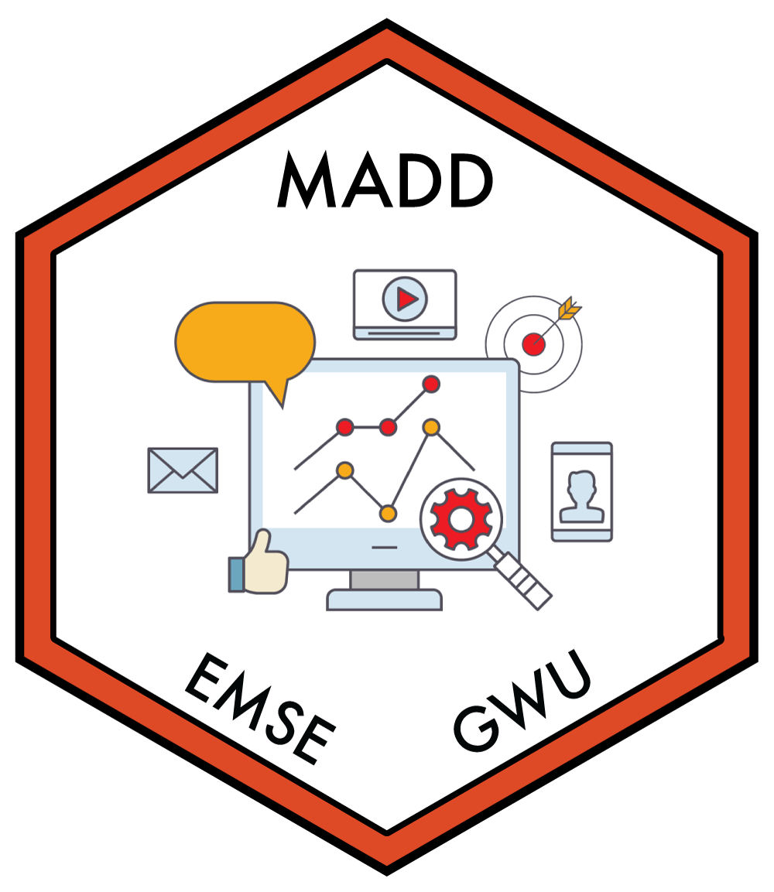

```{r setup, echo=FALSE, message=FALSE, warning=FALSE}
# Load libraries and settings here
library(tidyverse)
library(here)
knitr::opts_chunk$set(
  warning = FALSE,
  message = FALSE,
  comment = "#>",
  fig.path = "figs/", # Folder where rendered plots are saved
  fig.width = 7.252, # Default plot width
  fig.height = 4, # Default plot height
  fig.retina = 3 # For better plot resolution
)
```

Write your proposal content here. 

Make sure you update the settings in the YAML for your report. 

Use [markdown](https://commonmark.org/help/) for formatting, e.g.: **Bold**, _Italic_, etc.

Make a bullet list like this: 

- Item 1
- Item 2
- Item 3

Or a nubmered list like this: 

1. Item 1
2. Item 2
3. Item 3

If you want to insert an image in the `images` folder, you can insert it using html code like this: 

<center>

</center>

The code `<center>` and `</center>` just puts the image in the center of the page, the `src=""` part defines the path to the image, and the `width=300` part defines the image width in pixels - use that to adjust the image size in your report.

Here are some section headers to use: 


# Abstract
This study focuses on the various policies that the US Federal government can enact to increase COVID-19 vaccination rates and stabilize the spread of COVID-19 with herd immunity. It compares a universal vaccine mandate, the policy in question, to various positive incentives, such as tax rebates, and neutral incentives that focus on increasing access to the vaccine. The policy attributes valuable to the customer that are considered are:

- Safety of vaccines
- Efficacy in preventing COVID-19
- Protection of individual rights
- Attributes of the policy (positive, negative, neutral)
- Amount of funds given/fined ($) 


# Introduction

Over 80 million Americans are unvaccinated for COVID-19, a disease that forced life to shut down and decimated the overall health and the economy of the US. Many unvaccinated have numerous reservations against getting vaccinated, ranging from hesitancy due to mistrust in the American healthcare system, to political and religious oppositions. Every unvaccinated individual in the study is expected to respond to various policies, with some getting a vaccine, and others resisting the policies put in place. 

On September 9th, 2021, US President Joe Biden announced vaccine mandates for 100 million Americans, including federal employees and private-sector employees part of firms with over 100 people. This has been met with praise from some experts, who claim that forcing Americans to get vaccinated is crucial, criticism from other experts, who claim that resistance to vaccine mandates will cause labor shortages and is not effective enough to vaccinate enough of the population [for herd immunity], and hostile resistance, particularly from conservatives, who attack the Constitional provision of the mandates. [View this article to read some of the reactions to Biden's order.](https://www.nytimes.com/2021/09/09/world/biden-covid-vaccine-requirements-reaction.html?campaign_id=9&emc=edit_nn_20210910&instance_id=40054&nl=the-morning&regi_id=77202080&segment_id=68558&te=1&user_id=9d1be558afe1d0264747cb1778f62d0a)

Vaccine mandates have been touted for months, since the COVID-19 vaccine has become available. But before they were enacted many state and local governments started giving out positive incentives such as money or commodities. All levels of government, from the federal government to local, enacted iniatives to increase access to the vaccine by fighting misinformation and setting up mobile vaccination sites. 


# Target Population

There are approximately 80 million unvaccinated adults in the US. For each policy option, there is a different subset of populations that can potentially be impacted. Different groups of people and organizations have different opinions on each policy. If there is a negative policy (a mandate with a consequence for non-compliance), there is expected to be some resistance, especially from the far-right. But some people in the same sample group may be convinced to take a vaccine if there is a positive incentive for complying. To gain the best data possible, we will have to collect data on both the unvaccinated to vet how open the public is to getting vaccinated under different policies. We will also have to collect data on the vaccinated because we will have to see the overall picture on whether vaccine mandates would work. It is possible that majority of the unvaccinated will be opposed to vaccine mandates, but the vaccinated would want mandates in place because of concerns about vaccine-resistant variants. To account for bias in our data, we will have to make sure that we survey people from a wide range of backgrounds, ranging by: 

  - Race/ethnicity*: this would be achieved by reaching out to various faith and culture-based organizations (Neel was on the Executive Board of Hindu Students Association during undergrad and is able to reach out to the MSSC.)
  - Political beliefs: this would be achieved by reaching out political organizations to GW Young Americas Foundation, GW College Democrats, and GW College Republicans to get ample results from around the political compass. 
  - Income*: this would be achieved by asking GW students and others who fill out the survey about their income, and comparing that against who would favor different policies over COVID vaccinations. We can also reach out to the financial aid office to get more responses from people of underprivileged backgrounds as we are not violating ethical standards by doing so. 
  
*These factors are important because of the fact that people from underprivileged backgrounds are hesistant to take the vaccine because of mistrust in the American healthcare system. [A report by California State University, Northridge showcases and explains the disparties in vaccination rates amongst races](https://sundial.csun.edu/163812/news/vaccine-hesitancy-stands-in-the-way-of-reducing-covid-19-cases-in-communities-of-color/) 


*** IF TIME PERMITS *** 
It would be beneficial to collect supplemental data on businesses and influential people such as politicians because many businesses and politicians publish their stances on vaccines on common social media platforms such as Twitter. We would be gathering statements from a select few social media platforms and data about support for politicians and businesses (such as approval rating or popularity). Social media platforms such as Facebook and Twitter have APIs that will give us a collection of posts from these groups. Moreover, we would also use the Pollster API to collect approval ratings from top politicians, and social media APIs to get a sense of how popular businesses are. This data will allow us to infer opinions for a larger portion of the population based on our surveys. We would compare results for different factors, and model it for others in the same sub-group. This would not be a completely effective model, however, when modeling consumer choice of ordinary American citizens. Given the political climate of the United States and the number of recorded incidents of mask resistance in stores, it would not be effective as pushback will lead to Americans not complying. The following videos depict the extent Americans' negative reactions to mandates:

[Woman Sits on Floor in Anti-Mask Temper Tantrum](https://youtu.be/vAUeIBQoQCU)
[Parents Protest School Mask Mandate Shouting ‘Will Not Comply’ At Board Members](https://youtu.be/KT-qW5sNrwg)
[NYC teachers protest vaccine mandate](https://youtu.be/g521LRLFJZo)


# Policy Attributes

The policy attributes valuable to the government that are considered are:

- Safety of vaccines: Americans are concerned about the safety of the vaccine, given conspiracy theories that blow rare adverse reactions out of proportion. Americans must be convinced that conspiracy theories are false and that the vaccine is a harm-free way to protect themselves and others.  
- Efficacy in preventing COVID-19: Likewise to safety, Americans must be convinced that the vaccine is highly effective against SARS-COV-2. Currently, conspiracy theories falsely claim that vaccines are not effective. 
- Attributes of the policy (positive, negative, neutral): The DC plastic bag tax had a larger impact on plastic bag usage in DC than the DC plastic bag rebate. Whether Americans will be gaining something for complying, not be affected, or be losing something for not complying will determine Americans' behavior and attitude towards getting the vaccine. 


# Questions

- Which Americans favor/oppose the vaccine mandates? 
- What is the most effective policy to get people vaccinated?
- What are the net economic benefits of each vaccine policy?
- Are more Americans unsure about getting a COVID-19 vaccine, or are more Americans hostile towards getting a COVID-19 vaccine?
- When an unvaccinated, unmasked person steps in an elevator with you, do you get concerned? 


# Supplemental Questions

- How many Americans support donating vaccine doses abroad? 
- How many parents are willing to vaccinate children once a COVID-19 vaccine becomes available to them? 
