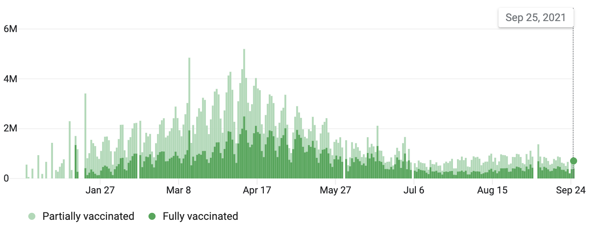
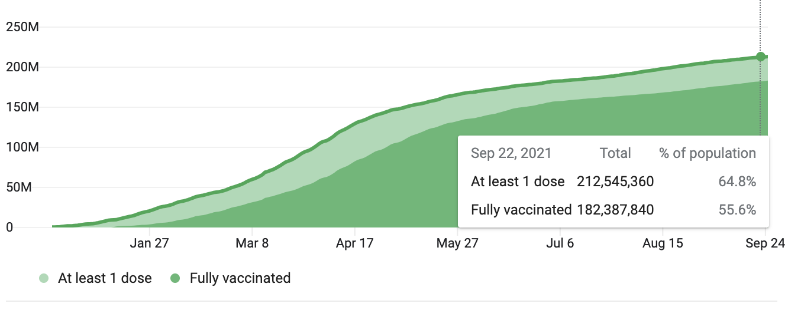

```{r setup, echo=FALSE, message=FALSE, warning=FALSE}
# Load libraries and settings here
library(tidyverse)
library(here)
library(spelling)
knitr::opts_chunk$set(
  warning = FALSE,
  message = FALSE,
  comment = "#>",
  fig.path = "figs/", # Folder where rendered plots are saved
  fig.width = 7.252, # Default plot width
  fig.height = 4, # Default plot height
  fig.retina = 3, # For better plot resolution
  
  spelling::spell_check_files("proposal.Rmd")
)
```


# Abstract

Despite the rollout of COVID-19 vaccines, vaccine hesitancy prevented the United States from achieving herd immunity, the level of immunity that a population has to control the spread of a virus. Below is a chart depicting the number of daily vaccinations over time as a percentage of the population, followed by a chart depicting the percentage of the American population that is vaccinated: 

<center>
  
</center>

<center>
  
</center>

In turn, the Delta variant, a highly-contagious strain of SARS-COV-2, the virus that causes COVID-19, ravaged through unvaccinated populations and caused a surge in cases. This study focuses on the various policies that the US Federal government can enact to increase COVID-19 vaccination rates and stabilize the spread of COVID-19 with herd immunity. It compares a vaccine mandate, the policy in question, to various positive incentives, such as tax rebates, and neutral incentives that focus on increasing access to the vaccine. The target population for this study are all unvaccinated Americans. The policy attributes valuable to the customer that are considered are:

Varying across all policies: 

- Protection of individual rights
- Enforcement of the policy (positive, negative, neutral)

Varying across each policy: 

- Value* given/fined ($) 
- Accessibility of the vaccine 

*Value is referring to the final value of any transaction or money that occurs as a result of the policy in question. 

# Introduction

Over 80 million Americans are unvaccinated for COVID-19, a disease that forced life to shut down and decimated the overall health and the economy of the US. Many unvaccinated Americans have numerous reservations against getting vaccinated, ranging from hesitancy due to mistrust in the American healthcare system, to political and religious oppositions. Every unvaccinated individual in the study is expected to respond to various policies, with some getting a vaccine, and others resisting the policies put in place.

On September 9th, 2021, US President Joe Biden announced vaccine mandates for 100 million Americans, including federal employees and private-sector employees part of firms with over 100 people. This has been met with praise from some experts who claim that forcing Americans to get vaccinated is crucial, criticism from other experts who claim that resistance to vaccine mandates will cause labor shortages and is not effective enough to vaccinate enough of the population [for herd immunity], and hostile resistance, particularly from conservatives, who attack the Constitutional provision of the mandates. [View this article to read some of the reactions to Biden's order.](https://www.nytimes.com/2021/09/09/world/biden-covid-vaccine-requirements-reaction.html?campaign_id=9&emc=edit_nn_20210910&instance_id=40054&nl=the-morning&regi_id=77202080&segment_id=68558&te=1&user_id=9d1be558afe1d0264747cb1778f62d0a)

Vaccine mandates have been touted for months, since the COVID-19 vaccine has become available. But before they were enacted many state and local governments started giving out positive incentives such as money or commodities. All levels of government, from the federal government to local, enacted initiatives to increase access to the vaccine by fighting misinformation and setting up mobile vaccination sites.


# Target Population

There are approximately 80 million unvaccinated adults in the US. For each policy option, there is a different subset of populations that can potentially be impacted. Different groups of people and organizations have different opinions on each policy. If there is a negative policy (a mandate with a consequence for non-compliance), there is expected to be some resistance, especially from the far-right. But some people in the same sample group may be convinced to take a vaccine if there is a positive incentive for complying. Another reason for the lack of vaccinations is the mistrust that underprivileged groups have towards the American healthcare system. This is the result of microaggressions from providers towards marginalized patients*. The most efficient and effective way, as we hypothesize, is to enact neutral policies that focus on a more aggressive anti-mistrust campaign, including educating these groups of people on the safety and efficacy on the vaccine. To gain the best data possible, we will have to collect data on both the unvaccinated to vet how open the public is to getting vaccinated under different policies. To account for bias in our data, we will have to make sure that we survey people from a wide range of backgrounds, ranging by:

- Race/ethnicity*: this would be achieved by reaching out to various faith and culture-based organizations (Neel was on the Executive Board of Hindu Students Association during undergrad and is able to reach out to the MSSC.)
- Political beliefs: this would be achieved by reaching out political organizations to GW Young Americas Foundation, GW College Democrats, and GW College Republicans to get ample results from around the political compass. 
- Income*: this would be achieved by asking GW students and others who fill out the survey about their income, and comparing that against who would favor different policies over COVID vaccinations. We can also reach out to the financial aid office to get more responses from people of underprivileged backgrounds as we are not violating ethical standards by doing so.

We will also be reaching out to the following people/groups to diversify our sample: 

- Dr. Lorien Abroms, a Public Health professor, runs the GW Health Communications Corps, an organization combatting health misinformation. Dr. Abroms would particularly be integral with identifying groups of people that succumb to microaggressions and have lower vaccination rates*. Dr. Abroms can also help us gain more samples from groups that succumb to misinformation about the vaccine, as [a report from HHS in August 2021 estimates that 44% of unvaccinated fall into the "unvaccinated but willing" category](hhttps://www.washingtonpost.com/health/2021/09/23/covid-unvaccinated-but-willing/?fbclid=IwAR26FWna18WL6-V__ofn441XM3cRf76NxEF6sWZdm-iNlO5q-his1OHocuk). This would help to reduce the bias in the sample towards a positive or negative policy, identifying a group of people that is willing to take the vaccine without any incentive or consequence wagered will help us identify the most efficient policy and whether incentives or fines are absolutely necessary. 
- Dr. Dennis Schell, a Psychology professor, teaches general and abnormal pyschology. He also works with people with adverse behavior issues, and will be able to help garner surveys from people with behavioral health issues on why they won't take the vaccine. With these people in our sample, we will be able to identify whether they can comply with a vaccine mandate. 
- Dr. Patrick McHugh is a Professor of Management. His research is focused on the psychology behind organizational structure and operations. He will be able to identify organizations that do not require vaccinations for its members, and give insight as to the reception towards vaccine mandates. He can also help us identify organizations that incentivize decisions, which we can send the survey to. 
- No Lost Generation GW is an organization that helps refugees adjust to living in the United States, particularly in the DC area. We can talk to the organization about getting refugees vaccinated by translating the survey into various languages and allowing refugees and immigrants to take them. 

*People from underprivileged backgrounds are hesitant to take the vaccine because of mistrust in the American healthcare system. [A report by California State University, Northridge showcases and explains the disparities in vaccination rates amongst races.](https://sundial.csun.edu/163812/news/vaccine-hesitancy-stands-in-the-way-of-reducing-covid-19-cases-in-communities-of-color/) 


*** IF TIME PERMITS *** 
It would be beneficial to collect supplemental data on businesses and influential people such as politicians because many businesses and politicians publish their stances on vaccines on common social media platforms such as Twitter. We would be gathering statements from a select few social media platforms and data about support for politicians and businesses (such as approval rating or popularity). Social media platforms such as Facebook and Twitter have APIs that will give us a collection of posts from these groups. Moreover, we would also use the Pollster API to collect approval ratings from top politicians, and social media APIs to get a sense of how popular businesses are. This data will allow us to infer opinions for a larger portion of the population based on our surveys. We would compare results for different factors, and model it for others in the same sub-group. This would not be a completely effective model, however, when modeling consumer choice of ordinary American citizens. Given the political climate of the United States and the number of recorded incidents of mask resistance in stores, it would not be effective as pushback will lead to Americans not complying. The following videos depict the extent Americans' negative reactions to mandates:

- [Woman Sits on Floor in Anti-Mask Temper Tantrum](https://youtu.be/vAUeIBQoQCU)
- [Parents Protest School Mask Mandate Shouting ‘Will Not Comply’ At Board Members](https://youtu.be/KT-qW5sNrwg)
- [NYC teachers protest vaccine mandate](https://youtu.be/g521LRLFJZo)


# Policy Attributes

The policy attributes valuable to the government that are considered are:


These two attributes vary across all policies, and policies were made with these in consderation: 

- Protection of individual rights: far-right media hosts and politicians weaponize misinformation to provide a sense of government control and keep Americans skeptical about the vaccine. Mandates would make getting vaccinated a responsibility, while incentives would keep getting vaccinated an individual choice. 
- Reinforcement of the policy (positive, negative, neutral): positive policies will wager incentives such as monetary compensation or tangible gifts to those who get vaccinated. Neutral policies focus on increasing access to the vaccine with no reward or consequence. And negative policies involve mandates with fines or other penalties for non-compliance.


These attributes can vary amongst individual policies: 

- Amount of funds given/fined ($): if a positive or negative policy is put in place, the amount of funds/goods wagered will influence the number of Americans that will comply. 
- Accessibility of the vaccine: since 44% of the unvaccinated fall into the "unvaccinated but willing" category, the policy in question can increase access to the vaccine and reduce the barriers that stop people from getting vaccinated. We can vary the distance from homes and physical access to a site, such as distance to public transportation.

Policy | Description | Key Attributes | Pros | Cons  
--------|-------------|----------------|------|-------
Monetary Incentive | A pure monetary incentive given to those who choose to receive the vaccine (not retroactive) | Value of incentive ($50-$500 with $50 increments) | Public approval, doesn't interfere with individual rights |
Vaccine Mandate | A tax penalty for those who do not comply to a vaccine mandate, enforced with tax returns | Value of fine ($50-$500 with $50 increments) | Government income, easy logistics, compatible with tax system | [Public outrage and pushback](https://youtu.be/bFk45V9wEQ4), may infringe on individual rights
Mobile Vaccination and Anti-Misinformation Sites | Mobile vaccination sites managed by the HHS that provide more accessibility for those who fall into the "unvaccinated but willing" category defined by the HHS. This site would be equipped with nurses that will give COVID vaccine doses to those who wish to receive one, and medical experts who will educate people and filter misinformation. | Accessibility to vaccination sites (see above) | Public approval, as people can get convinced to take a vaccine on the spot, doesn't interfere with individual rights | It would be logistically difficult to reach entire samples across the country, and maintaining a physical vaccination site is not only costly, but also increases the risk of COVID transmission.
Multivitamin Supplements | A supply of essential multivitamin supplements given to those who choose to receive the vaccine (not retroactive) | 6 months to 5 years with 6-month increments correlates to the value of supply provided | Offering multivitamins to those who get vaccinated will gain a higher level of public approval because [America is undergoing a nutrition crisis](https://www.everydayhealth.com/diet-nutrition/poor-nutrition-in-us-poses-threats-to-health-national-security-and-economy-panel-says/) which disparages marginalized groups. Offering a supply of nutrition to vaccinated will mitigate this crisis and increase vaccination rates. It also doesn't infringe on individual rights. | Difficult logistics to coordinate with the pharmaceutical industries, difficult logistics to distribute supplies to vaccination sites, costly

# Questions

- When an unvaccinated person steps in an elevator with you, do you get concerned?
- Are more Americans unwilling to get a COVID-19 vaccine, or are more Americans hostile towards getting a COVID-19 vaccine?
- What are the net economic benefits of each vaccine policy?
- What type of policy is most effective in increasing vaccination rates?
- What type of policy is seen as the most appropriate and most favorable to Americans?
- What types of incentives will convince Americans to get vaccinated? 

# Supplemental Questions

- How many Americans support donating vaccine doses abroad? 
- How many parents are willing to vaccinate children once a COVID-19 vaccine becomes available to them?
- If vaccine mandates are enacted, how many support universal enforcement during tax season? 
- How many are dissuaded from the vaccine due to the rollout of booster shots?

```{r helvys comments, echo=FALSE, message=FALSE, warning=FALSE}
# Write your proposal content here. 
# 
# Make sure you update the settings in the YAML for your report. 
# 
# Use [markdown](https://commonmark.org/help/) for formatting, e.g.: **Bold**, _Italic_, etc.
# 
# Make a bullet list like this: 
# 
# - Item 1
# - Item 2
# - Item 3
# 
# Or a numbered list like this: 
# 
# 1. Item 1
# 2. Item 2
# 3. Item 3
# 
# If you want to insert an image in the `images` folder, you can insert it using html code like this: 
# 
# <center>
# 
# </center>
# 
# The code `<center>` and `</center>` just puts the image in the center of the page, the `src=""` part defines the path to the image, and the `width=300` part defines the image width in pixels - use that to adjust the image size in your report.
# 
# Here are some section headers to use: 
```
